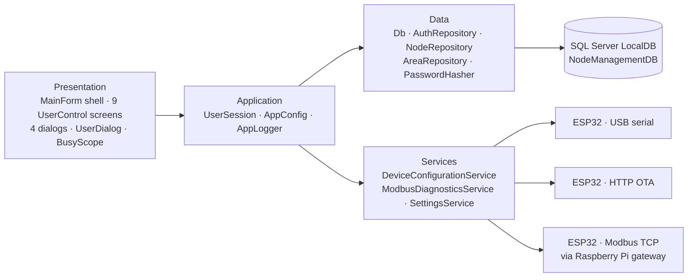
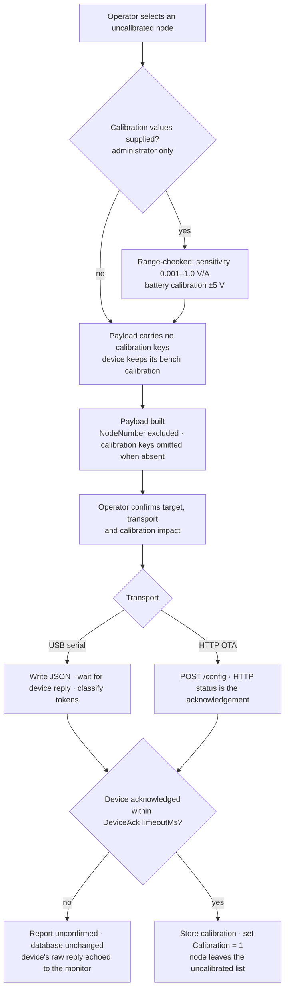
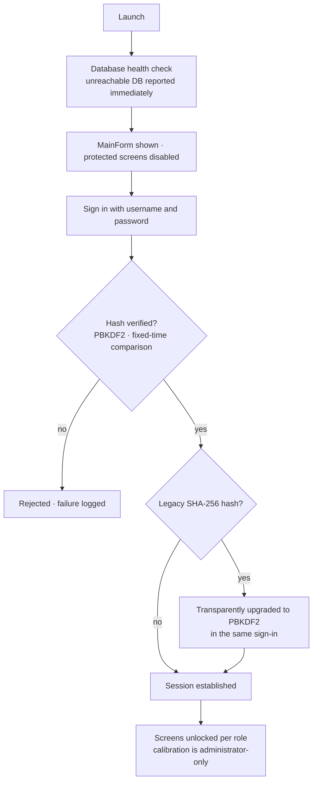

<div align="center">

# Node Calibration Utility

*Desktop commissioning tool for the I2ST smart-signage system*

**Configure, calibrate and deploy ESP32 edge controllers — over USB serial or the network — and record it only when the device confirms.**

**Version 2.0.0** &nbsp;·&nbsp; Windows Forms (.NET 10) &nbsp;·&nbsp; C# 12 &nbsp;·&nbsp; SQL Server LocalDB

[](https://dotnet.microsoft.com)
[](https://learn.microsoft.com/dotnet/desktop/winforms)
[](https://learn.microsoft.com/dotnet/csharp)
[](https://learn.microsoft.com/sql)
[](https://learn.microsoft.com/dotnet/core/tools/dotnet-build)

</div>

---

## Table of Contents

1. [Overview](#1-overview)
2. [Architecture & Flow Charts](#2-architecture--flow-charts)
3. [Database Schema](#3-database-schema)
4. [Device Communication](#4-device-communication)
5. [How the Application Works — Module by Module](#5-how-the-application-works--module-by-module)
6. [Core Invariants](#6-core-invariants)
7. [Project Structure](#7-project-structure)
8. [Getting Started](#8-getting-started)
9. [Configuration Reference](#9-configuration-reference)
10. [Engineering Notes](#10-engineering-notes)
11. [Roadmap & Known Limitations](#11-roadmap--known-limitations)
12. [Version History](#12-version-history)

---

## 1. Overview

A metro station's smart-signage system runs on a network of **ESP32-based edge
controllers** — one per signage panel — distributed across **four routes of up to
100 panels each**. Each controller drives relays, monitors two current-sensing
channels and a battery, and publishes its state over MQTT to a Raspberry Pi that
bridges it into Modbus TCP for the station's SCADA system.

Before a controller can join that network it has to be told **who it is**: its
route, its panel location, its panel serial number, the Modbus holding register it
owns, and its static IP address. It also needs per-device **calibration
constants** that convert raw ADC counts into amps and volts.

**Node Calibration Utility** is the tool a technician carries to a panel with a
laptop and a USB cable. It provides:

- a managed record of every panel position and the controller installed at it,
- validated data entry with database-enforced uniqueness,
- configuration deployment over **USB serial** or **Ethernet (OTA)**, recorded as
  done **only after the device acknowledges**,
- administrator-gated calibration with physical range checking,
- role-based access control over a SQL Server database.

The application builds clean — **0 errors, 0 warnings** (down from 80 warnings) —
with nullable reference types enforced on every hand-written line.

---

## 2. Architecture & Flow Charts

### 2.1 High-Level Architecture



- **Presentation** — the shell, screens and dialogs; no business logic.
- **Application** — identity and roles (`UserSession`), typed settings
  (`AppConfig`), diagnostic logging (`AppLogger`).
- **Data** — ADO.NET repositories over SQL Server LocalDB, with error
  translation and a start-up health check.
- **Services** — the three transports: serial/OTA deployment, Modbus TCP
  diagnostics, and atomic JSON settings persistence.

### 2.2 Deployment Flow — the path that matters most



### 2.3 Sign-in & Access Control



---

## 3. Database Schema

`NodeManagementDB` on SQL Server LocalDB. The application reads it as it stands —
the schema was not changed by this work.

### 3.1 `Users`

| Column | Type | Constraints |
|---|---|---|
| Id | INT | PK, IDENTITY |
| Username | NVARCHAR(50) | UNIQUE, NOT NULL |
| PasswordHash | NVARCHAR(255) | NOT NULL |
| FullName | NVARCHAR(100) | NOT NULL |
| CreatedAt | DATETIME | DEFAULT GETDATE() |

`PasswordHash` holds either a legacy 64-character SHA-256 hex string or a PBKDF2
record of the form `PBKDF2$<iterations>$<base64 salt>$<base64 hash>`. Both are
accepted; legacy rows are upgraded on their next successful sign-in. The column
is already wide enough for the PBKDF2 format, so **no migration is required**.

### 3.2 `Areas` — 400 pre-seeded rows (4 routes × 100 panels)

| Column | Type | Constraints |
|---|---|---|
| Id | INT | PK, IDENTITY |
| Route | INT | NOT NULL |
| PanelLocation | INT | NOT NULL |
| HoldingRegister | INT | UNIQUE, NOT NULL |
| PanelSerialNumber | INT | UNIQUE, NOT NULL |
| Description | NVARCHAR(255) | NULL |

Plus `UNIQUE(Route, PanelLocation)`.
`HoldingRegister = 40000 + (Route-1)×100 + PanelLocation`, assigned at seed time
and treated as immutable — the firmware and the Modbus bridge both key off it.

### 3.3 `Nodes`

| Column | Type | Default |
|---|---|---|
| Id | INT | PK, IDENTITY |
| NodeNumber | INT | UNIQUE, NOT NULL |
| PanelSerialNumber | INT | UNIQUE, NOT NULL, FK → `Areas` |
| LocalIPAddress | NVARCHAR(15) | UNIQUE, NOT NULL |
| Zerovolt_CS1 / _CS2 | FLOAT | 2.40 |
| Sensitivity_CS1 / _CS2 | FLOAT | 0.105 |
| Threshold_CS1 | FLOAT | 0.100 |
| Threshold_CS2 | FLOAT | 0.120 |
| BatteryCalibration | FLOAT | 0.0 |
| BatterySagCompensation | FLOAT | 0.0 |
| PSUThreshold | INT | 1800 |
| Calibration | BIT | 0 |

Database column names are retained; the C# model uses conventional casing
(`ZeroVoltCs1`, `IsCalibrated`) and maps explicitly in the repository.

`Calibration` is set to **1 only after a controller has confirmed** its
configuration — never on a successful write alone.

---

## 4. Device Communication

### 4.1 Configuration payload

The JSON sent to the ESP32. Two properties are load-bearing:

```json
{
  "Route": 2,
  "PanelLocation": 5,
  "PanelSerialNumber": 40005,
  "HoldingRegister": 40005,
  "Description": "Platform 3, Column B",
  "LocalIP": "192.168.1.105"
}
```

- **`NodeNumber` is deliberately absent.** The controller derives its node
  identity from the holding register; a second source of truth could disagree
  with the first.
- **Calibration keys are omitted entirely unless an administrator supplied
  them.** The firmware overwrites a stored constant only when its key is
  present, so an absent key preserves the bench calibration. Sending nulls or
  zeros would wipe it. This is enforced by
  `[JsonIgnore(JsonIgnoreCondition.WhenWritingNull)]`, not by convention. With
  calibration, three keys appear: `Sensitivity_CS1`, `Sensitivity_CS2`,
  `BatteryCalibration`.

Reset payload: `{"ResetConfig": true}` — clears stored preferences and restarts.

The controller restarts unconditionally after accepting configuration.

### 4.2 Transports

| Transport | Details |
|---|---|
| USB serial | 115200 8-N-1, newline-terminated JSON, configurable acknowledgement timeout |
| HTTP OTA | `POST http://<device-ip>/config`, 5-second timeout, response body reported on failure |
| Modbus TCP | via the Raspberry Pi gateway on port 502, explicit connect timeout |

### 4.3 Diagnostic register map

Zero-based addresses. Node *N* occupies six registers from `5000 + (N-1)×6`:

| Offset | Meaning |
|---|---|
| +0 | Status (1 = ONLINE) |
| +1 | Power (1 = OK) |
| +2 | Current channel 1 (1 = OK) |
| +3 | Current channel 2 (1 = OK) |
| +4 | Battery percentage (0 / 50 / 100) |
| +5 | Relay status (bit 0 = relay 1, bit 1 = relay 2) |

Control ranges: MUX at `3000` (Modbus 43001), manual relays from `1000`
(Modbus 41001), SCADA from `2000` (Modbus 42001).

---

## 5. How the Application Works — Module by Module

### 5.1 Node Management

- Route-filtered grid of every installed controller, joined to its panel
  position.
- Add, edit and delete with full validation: IPv4 format, positive node
  numbers, uniqueness on node number, IP address and panel serial number.
- **Uncalibrated nodes are highlighted** in the grid, so outstanding
  commissioning work is visible at a glance — exactly where the person who has
  to act on it is looking.
- Double-click a row to edit.
- Records are re-read before an edit opens, so a node changed or removed from
  another workstation is detected instead of silently overwritten.

### 5.2 Area (Panel Position) Management

- All 100 panel positions for a selected route, from a table pre-seeded with
  every route/panel combination.
- Panel serial number and description are editable; route, panel location and
  holding register are read-only, because the firmware and the Modbus bridge
  both key off the register mapping.
- Changing a serial number requires explicit confirmation — it re-points the
  node foreign key and must match the number physically stencilled on the panel.

### 5.3 Configuration Deployment

- **Two transports**: USB serial for bench and on-panel work, HTTP OTA for
  controllers already on the network.
- **Acknowledgement required.** A deployment is recorded as successful only
  once the controller confirms it. Writing bytes to a COM port proves nothing
  about the device having received or accepted them, so the tool waits for the
  reply and classifies it — confirmation tokens (`config saved`, `restarting`,
  …) succeed; rejection tokens (`error`, `invalid`, `bad json`, …) fail; no
  reply or an unrecognised reply is reported as **unconfirmed**. On any outcome
  other than success the node is explicitly *not* marked as calibrated and the
  device's raw reply is echoed to the serial monitor so the operator can see
  why.
- Live serial monitor with the device's own output.
- Pre-deployment confirmation stating the target, the transport, and whether
  calibration will be overwritten or preserved — the controller restarts on
  accepting a payload.
- Reset-to-defaults command that clears the controller's stored preferences.

### 5.4 Calibration Control

- **Administrator-only.** Calibration changes the meaning of every reading a
  node publishes, so it is deliberately restricted.
- Current values are pre-loaded from the database, so an operator adjusts from
  what the device is actually running rather than typing into empty boxes.
- **Range-checked before transmission**: sensitivity is bounded to 0.001–1.0
  V/A (the ACS712-class sensors on these panels sit in the tens-to-hundreds of
  mV/A) and battery calibration to ±5 V — so a typo or a wrong unit is caught
  before it silently corrupts every subsequent measurement.
- Calibration keys are **omitted** from the payload unless supplied, because
  the firmware preserves any constant whose key is absent.

### 5.5 Authentication & Access Control

- Sign-in against the SQL Server `Users` table.
- **PBKDF2-HMAC-SHA256** password hashing with a 16-byte random salt and
  600,000 iterations (OWASP's 2023 figure), verified in fixed time.
- **Backward compatible**: legacy unsalted SHA-256 rows still authenticate and
  are transparently upgraded to PBKDF2 on the next successful sign-in — the one
  moment the plaintext is available. No user has to reset anything, and a
  failed upgrade is logged without blocking the sign-in.
- Protected screens are genuinely gated. Access control lives in `UserSession`
  and is applied by `MainForm.ApplySessionState()`; `NavigateProtected()`
  refuses to open a protected screen and explains why. Home remains available
  so there is always somewhere to be.
- Admin status is decided in one place — `UserSession.CanCalibrate` — rather
  than by a string comparison inside a form.

### 5.6 Modbus Diagnostics

- Reads each node's 6-register diagnostic block — status, power, both current
  channels, battery percentage and relay state — through the Raspberry Pi
  gateway.
- Writes to the MUX, manual relay and SCADA register ranges.
- Connect timeout applied explicitly, because `TcpClient` has none of its own
  and an unreachable gateway would otherwise block for the OS default (~20 s).
- Connections are owned and disposed correctly; a reconnect is forced after any
  failure.

### 5.7 Settings & Network Configuration

- Technician contact details and maintenance-notification preferences.
- Ethernet and Wi-Fi parameters, with the Wi-Fi group shown only when enabled
  and the pre-shared key **masked** — a visible PSK on a shared commissioning
  workstation is a real exposure.
- Every populated address field is validated as a genuine dotted-quad IPv4 — a
  controller that comes up on the wrong subnet has to be recovered over USB on
  site.
- Persisted atomically to per-user application data (temp file then replace),
  so an interrupted save cannot leave a file that fails to parse on next
  launch.

### 5.8 Operational Robustness

- **Responsive UI.** Every database and device call is asynchronous with
  `CancellationToken` support; controls cancel in-flight work when torn down,
  so a query that returns after a screen closed cannot touch a disposed
  control. `BusyScope` restores busy state on dispose even if the operation
  throws.
- **Diagnostic logging.** A dated rolling file log under `%LOCALAPPDATA%`
  (pruned to 14 files) records every repository failure, deployment attempt,
  device reply and rejected sign-in.
- **Survivable errors.** `Program` installs handlers for thread, unhandled and
  unobserved-task exceptions — a UI-thread fault is reported and the operator
  keeps their other work.
- **Start-up health check.** An unreachable database or missing tables is
  reported immediately, not as a stack trace on first use.
- **Single instance.** A named mutex prevents two copies competing for the same
  COM port and sending conflicting configuration to one controller.
- **Externalised configuration.** Connection string, gateway address, baud
  rate, timeouts and route counts all live in `appsettings.json`; retargeting a
  deployment needs no rebuild.

---

## 6. Core Invariants

1. **`NodeNumber` is never sent to the controller.**
2. **Calibration keys are omitted unless explicitly supplied.** An absent key
   preserves the device's stored value.
3. **`Calibration = 1` is written only after the device acknowledges.** Never
   on a successful write alone.
4. **`HoldingRegister` is immutable** — the firmware and the Modbus bridge both
   key off it.
5. **`Areas` is update-only.** Never inserted into or deleted from at runtime.
6. **`Nodes.PanelSerialNumber` is not updatable.** Moving a controller is a
   delete-and-re-add.
7. **Node number, IP address and panel serial number are each unique**, enforced
   by the database — pre-checks exist for better error messages, but unique
   constraints are the actual guarantee, with constraint violations returned as
   a normal outcome naming the offending field.
8. **Machine-facing values use `InvariantCulture`.** Node numbers, IP addresses
   and register values must not vary with the operator's regional settings.
9. **Calibration is administrator-only.**
10. **Dialogs validate and collect; callers persist.** A dialog never writes to
    the database itself.

---

## 7. Project Structure

```
CompanyUtilityApp/
├─ CompanyUtilityApp.csproj      metadata, analyser policy, config copying
├─ appsettings.json              all externalised settings
├─ Program.cs                    entry point, global exception handling
│
├─ Configuration/
│  └─ AppConfig.cs               strongly typed settings loader
│
├─ Models/
│  ├─ User.cs · Area.cs · Node.cs
│  ├─ ViewModels.cs              grid projections
│  ├─ DeviceConfigurationPayload.cs   firmware contract + calibration validation
│  └─ Settings.cs                preferences + IPv4 validation
│
├─ Security/
│  └─ PasswordHasher.cs          PBKDF2 with legacy SHA-256 migration
│
├─ Data/
│  ├─ Db.cs                      connection factory, error translation, health check
│  ├─ AuthRepository.cs          authentication, transparent hash upgrade
│  ├─ AreaRepository.cs
│  └─ NodeRepository.cs          node CRUD, calibration status
│
├─ Services/
│  ├─ DeviceConfigurationService.cs   serial + OTA deployment (ack-gated)
│  ├─ ModbusDiagnosticsService.cs     Modbus TCP reads/writes (IDisposable)
│  └─ SettingsService.cs              atomic JSON persistence
│
├─ Infrastructure/
│  ├─ AppLogger.cs               rolling file logger
│  └─ UserSession.cs             session state + role gating
│
├─ UI/
│  └─ UserDialog.cs              dialog helpers + BusyScope
│
├─ Forms/                        MainForm · LoginForm · AddEditNodeForm · EditAreaForm
├─ UserControls/                 Home · Node · Area · PanelSettings · Settings
│                                Network · Tests · IOActivity · Transfer
├─ Properties/ · Resources/      icons and resources
└─ DocumentFiles/                user manual PDF
```

Around **5,400 lines of hand-written C# across 22 files**, plus
designer-generated layout. Namespaces match folders
(`CompanyUtilityApp.Forms`, `.UserControls`, `.Data`, …) — a resource-lookup
bug depended on this, see §10.

---

## 8. Getting Started

### 8.1 Prerequisites

- Windows 10 or 11
- [.NET 10 SDK](https://dotnet.microsoft.com/download)
- SQL Server LocalDB (ships with Visual Studio, or the standalone *SQL Server
  Express LocalDB* installer)
- A USB cable for serial deployment, or network reachability for OTA

### 8.2 Database setup

Create `NodeManagementDB` with the three tables in [§3](#3-database-schema),
then:

1. Seed `Areas` with all 400 route/panel rows.
   `HoldingRegister = 40000 + (Route-1)×100 + PanelLocation`.
2. Insert at least one row into `Users`. Both password formats are accepted, so
   existing credentials work unchanged and are upgraded to PBKDF2 on first
   sign-in.

### 8.3 Build and run

```powershell
git clone <repository-url>
cd CompanyUtilityApp\CompanyUtilityApp

dotnet build     # expect 0 errors, 0 warnings
dotnet run
```

If the database is unreachable or tables are missing, the application says so
at start-up rather than failing later.

### 8.4 Runtime paths

| What | Where |
|---|---|
| Configuration | `appsettings.json`, beside the executable |
| Logs | `%LOCALAPPDATA%\I2ST\NodeCalibration\logs` |
| Settings | `%LOCALAPPDATA%\I2ST\NodeCalibration\settings.json` |

---

## 9. Configuration Reference

All of `appsettings.json` is editable without a rebuild. A malformed file falls
back to built-in defaults and reports why, rather than refusing to start — a
site engineer should not be stranded by a stray comma.

```json
{
  "Database": {
    "ConnectionString": "Server=(localdb)\\MSSQLLocalDB;Database=NodeManagementDB;Integrated Security=true;TrustServerCertificate=true",
    "CommandTimeoutSeconds": 30
  },
  "Modbus": {
    "GatewayHost": "192.168.1.10",
    "Port": 502,
    "SlaveId": 1,
    "ConnectTimeoutMs": 3000,
    "ReadWriteTimeoutMs": 3000
  },
  "Serial": {
    "BaudRate": 115200,
    "DataBits": 8,
    "Parity": "None",
    "StopBits": "One",
    "ReadTimeoutMs": 2000,
    "WriteTimeoutMs": 2000,
    "DeviceAckTimeoutMs": 8000
  },
  "Ota": {
    "RequestTimeoutSeconds": 5,
    "ConfigEndpoint": "/config"
  },
  "Routes": {
    "Count": 4,
    "PanelsPerRoute": 100
  },
  "Logging": {
    "MinimumLevel": "Information",
    "RetainedFileCount": 14
  }
}
```

**`DeviceAckTimeoutMs`** is the one worth knowing about: it is how long the tool
waits for a controller to confirm a serial deployment before reporting it
unconfirmed.

---

## 10. Engineering Notes

A few decisions that are easy to misread as arbitrary:

**A serial write is not a deployment.** `SerialPort.Write` returning without
throwing only means the bytes reached the local UART buffer. An unplugged
cable, a device in bootloader mode, or a rejected payload all produce a
successful write. Since a node marked as calibrated disappears from the
deployment list, trusting the write would make a failed commissioning
invisible. The tool therefore waits for the controller's own reply — classified
against deliberately adjustable token sets — and only then records success.

**Uniqueness is enforced by the database, not by a pre-check.** A
check-then-write leaves a window in which another workstation can take the
value. The pre-checks are kept for their better error messages, but a
constraint violation (SQL 2627/2601) is caught and returned as a normal outcome
with a message naming the offending field, parsed from the index name.

**Settings live in `%LOCALAPPDATA%`, not beside the binary.** A Program Files
directory is not writable by a standard user; saving next to the executable
either fails or silently triggers UAC virtualisation.

**Namespaces must match folders — and a bug proved it.** `MainForm.Designer.cs`
resolved embedded resources with `ComponentResourceManager`, which looks up
`<class namespace>.MainForm.resources` while the embedded resource name is
derived from `RootNamespace` + folder path. The file lived in `WindowForms\`
under namespace `CompanyUtilityApp`, so the lookup silently failed and the
toolbar icon never loaded — except in the one control that happened to declare
the matching namespace. Renaming `WindowForms\` → `Forms\` and aligning
namespaces to folders throughout fixed it. This is why the namespace
normalisation was worth doing.

**Machine-facing values are formatted with `InvariantCulture`.** Node numbers,
IP addresses and register values must not vary with the operator's regional
settings.

**Nullable reference types are enforced, and generated files are excluded.**
Designer fields are assigned inside `InitializeComponent()`, where the analyser
cannot see them, so designer files carry `#nullable disable` — the approach the
WinForms templates themselves use. Hand-written code is fully checked, with the
CS86xx nullable set as `WarningsAsErrors`. The build went from 80 warnings to
clean.

---

## 11. Roadmap & Known Limitations

| Area | Status |
|---|---|
| Node management | Complete |
| Area management | Complete |
| Configuration deployment (serial + OTA) | Complete — **pending hardware validation** |
| Calibration control | Complete |
| Authentication and access control | Complete |
| Settings / network configuration | Complete |
| Modbus transport | Complete — untested against a live gateway |
| Operation and endurance tests | Planned — transport in place, UI outstanding |
| Live I/O activity view | Planned |
| CSV import / export | Planned — export first; import awaits per-row validation and rollback |

**The single most important thing to test before trusting the tool on site** is
the deployment acknowledgement against a real controller: the reply
classification is written against the documented firmware behaviour and has not
been observed against live hardware. If the firmware's actual output does not
contain the expected tokens, deployments will be reported as unconfirmed even
when they succeeded. The token lists are near the top of
`DeviceConfigurationService` and are deliberately easy to adjust.

Other known follow-ups:

- **Migrate from `NModbus4` to `NModbus`.** The former ships .NET Framework
  binaries only and runs on `net10.0` through the compatibility shim (NU1701,
  suppressed with justification in the csproj). The change is contained to
  `ModbusDiagnosticsService` but needs gateway testing.
- **Add a role column to `Users`.** Administrator status is currently inferred
  from the username (documented in `Models\User.cs`).
- **Add a test project.** There is none; two methods containing SQL that
  referenced non-existent columns survived in the codebase precisely because
  nothing exercised them.
- **Consider an audit trail.** Node changes and deployments are logged to file,
  but nothing records who changed what in the database.

---

## 12. Version History

| Version | Date | Highlights |
|---|---|---|
| **2.0.0** | 2026-08-20 | Security and reliability overhaul: PBKDF2 password hashing with legacy migration · acknowledgement-gated deployment (serial write alone no longer marks a node calibrated) · session-based access control (previously commented out) · fully asynchronous data layer · rolling diagnostics log and survivable crash handling · two inert settings screens wired to real persistence · config externalised to `appsettings.json` · 80 warnings eliminated |

This repository begins at **v2.0.0**; the pre-refactor version is not part of
this history.

---

<div align="center">
  <strong>Node Calibration Utility</strong> · I2ST Technologies Pvt. Ltd. © 2026
</div>
